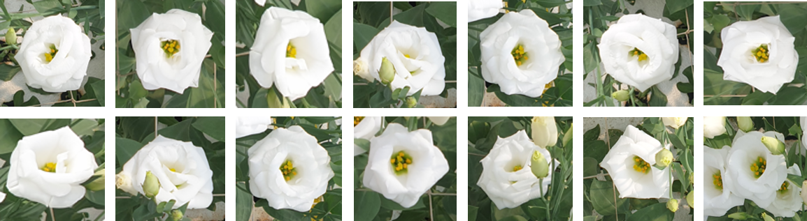
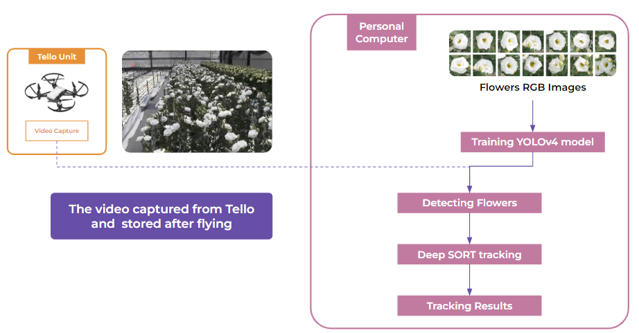

# Flowers Tracker
## 1. Overview
Object tracking implemented with YOLOv4, DeepSort, and TensorFlow. YOLOv4 is a state of the art algorithm that uses deep convolutional neural networks to perform object detections. We can take the output of YOLOv4 feed these object detections into Deep SORT (Simple Online and Realtime Tracking with a Deep Association Metric) in order to create a highly accurate object tracker.



The framework is as the figure shown below. The RGB flowers images will be captured for the YOLOv4 model training. And onces the practical implementation as the drone receive the video streaming while mission, the images stack could store in the backend and running the flowers tracker to tracking the flowers on the route. By applying the tracker, it could easily count the amount of flowers in the correspoing path.




## 2. Quick Start
* Install the proper depencies. Notes that TensorFlow 2 packages require a pip version > `19.0`.
```bash
# TensorFlow CPU
pip install -r requirements.txt

# TensorFlow GPU
pip install -r requirements-gpu.txt
```
* Converting darknet model into `tensorflow` format, and running the object tracker. Take tiny model for examples here.
```bash
# convert yolov4-tiny model
python converter.py --weights ./data/yolov4-tiny.weights 
					--output ./checkpoints/yolov4-tiny-416 
					--model yolov4 --tiny

# Run yolov4-tiny object tracker
python tracker.py --weights ./checkpoints/yolov4-tiny-416 
				  --video ./data/video/test.mp4 
				  --output ./outputs/tiny.avi
				  --model yolov4 --tiny
```


## 3. Demo of Object Tracker on Flowers

## 4. Citation
__YOLOv4__
```
@article{bochkovskiy2020yolov4,
	title={Yolov4: Optimal speed and accuracy of object detection},
	author={Bochkovskiy, Alexey and Wang, Chien-Yao and Liao, Hong-Yuan Mark},
	journal={arXiv preprint arXiv:2004.10934},
	year={2020}
}
```

__Deep SORT__
```
@inproceedings{wojke2017simple,
	title={Simple online and realtime tracking with a deep association metric},
  	author={Wojke, Nicolai and Bewley, Alex and Paulus, Dietrich},
  	booktitle={2017 IEEE international conference on image processing (ICIP)},
  	pages={3645--3649},
  	year={2017},
  	organization={IEEE}
}

@inproceedings{wojke2018deep,
  	title={Deep cosine metric learning for person re-identification},
  	author={Wojke, Nicolai and Bewley, Alex},
  	booktitle={2018 IEEE winter conference on applications of computer vision (WACV)},
  	pages={748--756},
  	year={2018},
  	organization={IEEE}
}
```

## 5. Referencea
* [deep sort](https://github.com/nwojke/deep_sort)
* [tensorflow yolov4 tflite](https://github.com/hunglc007/tensorflow-yolov4-tflite)