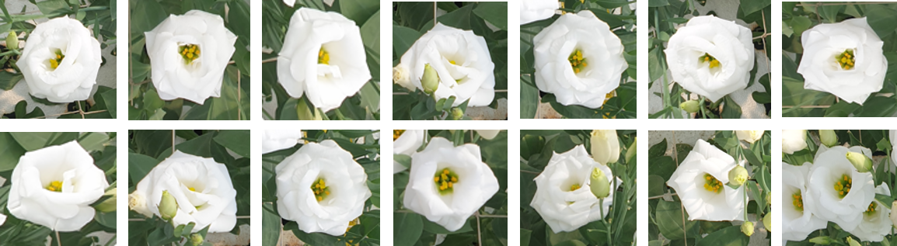

# Flowers Tracker
A tracker and counter for Eustoma Grandiflorum flowers by using `YOLOv4` and `Deep SORT`.



## Requirement
* tensorflow-gpu
* opencv-python
* numpy
* tqdm
* argparse
* matplotlib
* pillow

## Instruction
__0. Requirements Setup__
```shell
# tensorflow CPU
pip install -r requirements.txt

# tensorflow GPU
# tensorflow 2 packages require a PIP version > 19.0
pip install -r requirements-gpu.txt
```
__1. Download Repository__
```shell
git clone https://github.com/KoKoLates/Flowers-Tracker.git
```
__2. Download the model and weights__ <br>


__3. Convert the darknet model into tensortflow model__
```shell
python converter.py --model yolov4

python converter.py --weights ./data/yolov4-tiny.weights --output ./checkpoints/yolov4-tiny --model yolov4 --tiny
```

__4. Running the YOLO v4 deep SORT__
```shell
# Run yolov4 deep sort object tracker on video
python tracker.py --video ./data/video/test.mp4 --output ./outputs/demo.avi --model yolov4

python object_tracker.py --weights ./checkpoints/yolov4-tiny --model yolov4 --video ./data/video/test.mp4 --output ./outputs/tiny.avi --tiny
```

## Citation

__YOLOv4__
```
@article{bochkovskiy2020yolov4,
  title={Yolov4: Optimal speed and accuracy of object detection},
  author={Bochkovskiy, Alexey and Wang, Chien-Yao and Liao, Hong-Yuan Mark},
  journal={arXiv preprint arXiv:2004.10934},
  year={2020}
}
```

__Deep_SORT__
```
@inproceedings{wojke2017simple,
  title={Simple online and realtime tracking with a deep association metric},
  author={Wojke, Nicolai and Bewley, Alex and Paulus, Dietrich},
  booktitle={2017 IEEE international conference on image processing (ICIP)},
  pages={3645--3649},
  year={2017},
  organization={IEEE}
}

@inproceedings{wojke2018deep,
  title={Deep cosine metric learning for person re-identification},
  author={Wojke, Nicolai and Bewley, Alex},
  booktitle={2018 IEEE winter conference on applications of computer vision (WACV)},
  pages={748--756},
  year={2018},
  organization={IEEE}
}
```